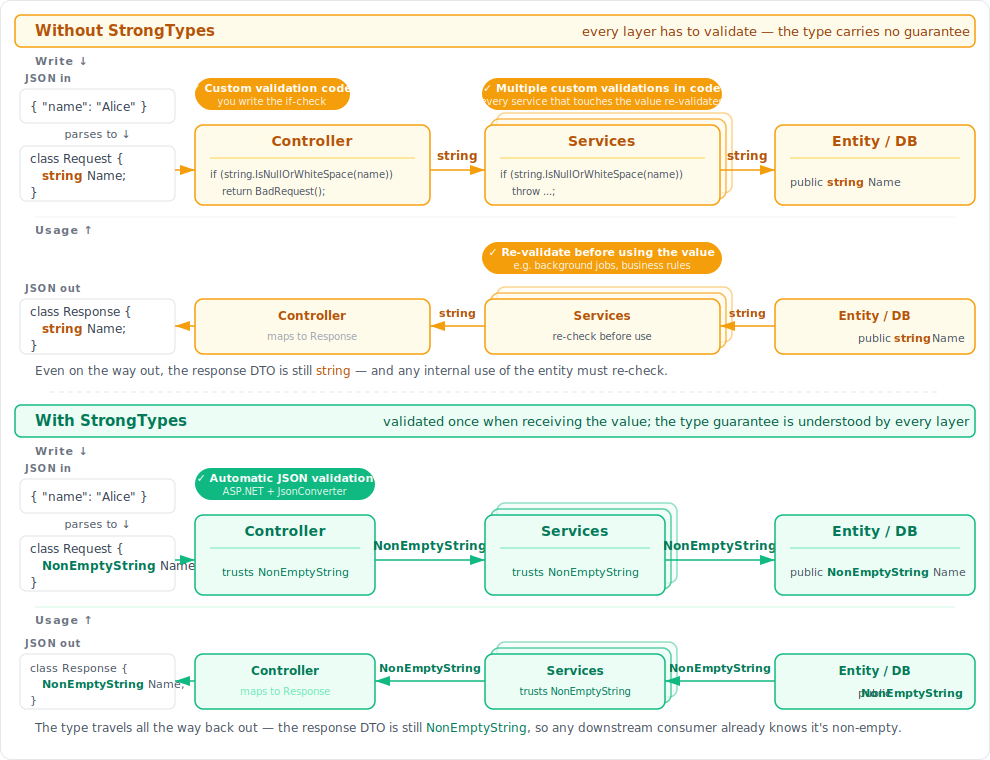
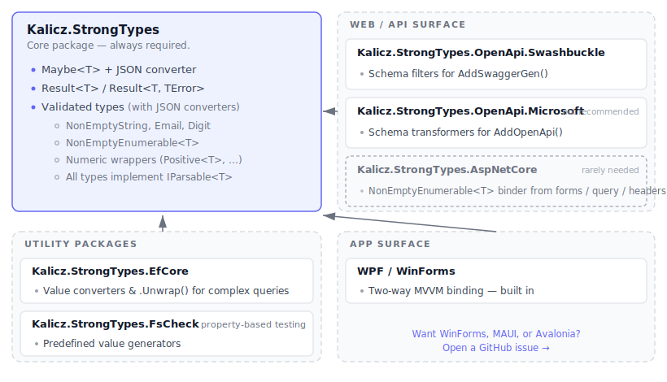
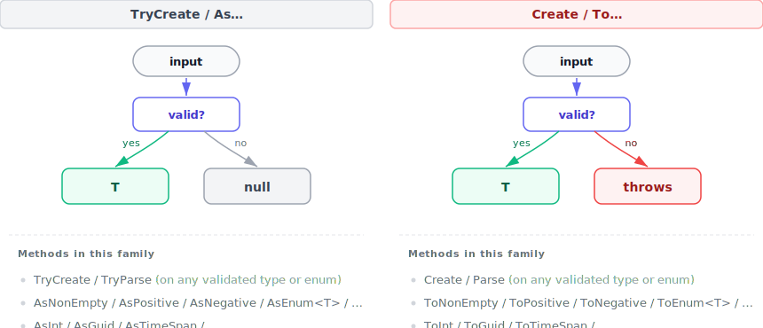
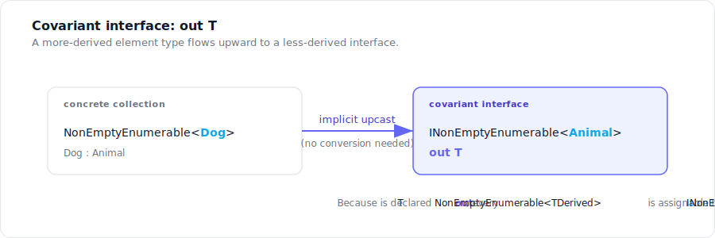
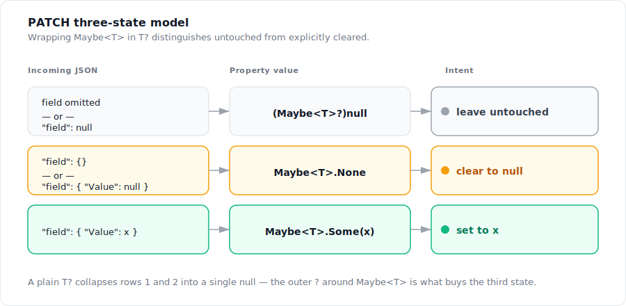
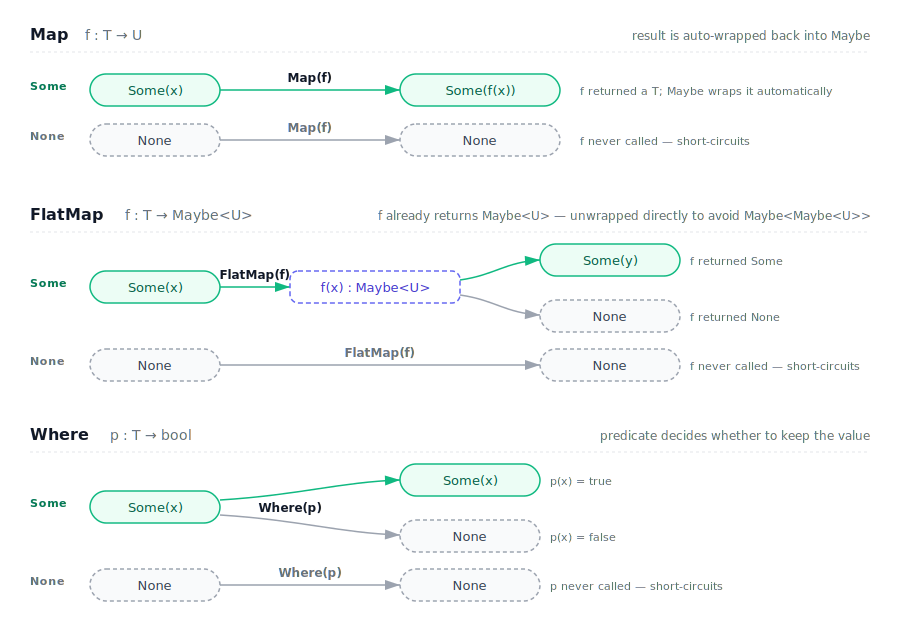
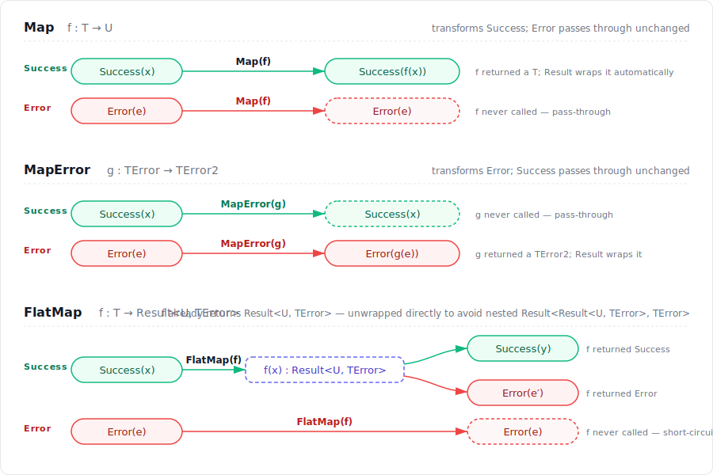

# Kalicz.StrongTypes for C#

[](https://www.nuget.org/packages/Kalicz.StrongTypes/) [](https://www.nuget.org/packages/Kalicz.StrongTypes/) [](https://github.com/KaliCZ/StrongTypes/blob/main/license.txt)

StrongTypes adds small, focused types that make everyday code safer and more expressive. Every type ships with `System.Text.Json` converters out of the box, so invalid JSON fails at deserialization. The types can be stored directly in EF Core entities via the EfCore package, OpenAPI documentation is supported through the Microsoft or Swashbuckle OpenAPI packages, WPF is supported via the WPF package, and an ASP.NET Core package adds MVC model binders for `Maybe<T>` and `NonEmptyEnumerable<T>` from `[FromForm]` (and other non-body sources) — see [Packages](#packages) below.

> 🤖 Letting Claude Code or Codex write code in a project that uses
> StrongTypes? See [Use with Claude or Codex](#use-with-claude-or-codex)
> below.

<picture>
  <source media="(prefers-color-scheme: dark)" srcset="docs/diagrams/impact-dark.svg">
  
</picture>

### What's included

<picture>
  <source media="(prefers-color-scheme: dark)" srcset="docs/diagrams/package-layout-dark.svg">
  
</picture>

## Contents

- [Use with Claude or Codex](#use-with-claude-or-codex)
- [Helpful Types](#helpful-types)
  - [`NonEmptyString`](#nonemptystring)
  - [Numeric wrappers: `Positive<T>`, `NonNegative<T>`, `Negative<T>`, `NonPositive<T>`](#numeric-wrappers)
  - [What you get for free](#what-you-get-for-free)
  - [JSON serialization](#json-serialization)
  - [EF Core persistence](#ef-core-persistence)
  - [OpenAPI / Swagger schema](#openapi--swagger-schema)
  - [WPF MVVM binding](#wpf-mvvm-binding)
- [`NonEmptyEnumerable<T>`](#nonemptyenumerablet)
- [Parsing helpers](#parsing-helpers)
  - [Enums](#enums)
  - [Strings](#strings)
- [Algebraic types](#algebraic-types)
  - [Prefer nullables: `Map`, `MapTrue`, `MapFalse`](#prefer-nullables-map-maptrue-mapfalse)
  - [`Maybe<T>`](#maybet)
  - [`Result<T, TError>`](#resultt-terror)
- [Packages](#packages)

## Use with Claude or Codex

The skill lives in [`Skill/`](Skill/). Drop it under your project's
`.claude/skills/strongtypes/` (or `~/.claude/skills/strongtypes/` for
user scope; swap `.claude` for `.codex` for Codex) and the agent picks
it up. Each release ships a `strongtypes-skill.tar.gz` asset:

```bash
mkdir -p .claude/skills/strongtypes
curl -L https://github.com/KaliCZ/StrongTypes/releases/latest/download/strongtypes-skill.tar.gz \
  | tar -xz -C .claude/skills/strongtypes
```

[↑ Back to contents](#contents)


## Helpful Types

The `TryCreate` / `Create` split (and the `As…` / `To…` extensions that mirror it) is used across every validated type in the library — pick the factory that matches how you want to handle bad input at the call site:

<picture>
  <source media="(prefers-color-scheme: dark)" srcset="docs/diagrams/trycreate-create-flow-dark.svg">
  
</picture>

### `NonEmptyString`

A string guaranteed to be non-null, non-empty, and not just whitespace. Construct it via the factory pair:

```csharp
NonEmptyString? name = NonEmptyString.TryCreate(input); // null when null/empty/whitespace
NonEmptyString  name = NonEmptyString.Create(input); // Throws ArgumentException
NonEmptyString? name = userInput.AsNonEmpty();
```

`NonEmptyString` exposes the common `string` surface (`Length`, `Contains`, `StartsWith`, `Substring`, `ToUpper`, …) and implicitly converts to `string`.

[↑ Back to contents](#contents)

### Numeric wrappers

Four generic wrappers that enforce a sign invariant on any `INumber<T>` — `int`, `long`, `short`, `decimal`, `float`, `double`, and so on:

| Type              | Invariant                  |
| ----------------- | -------------------------- |
| `Positive<T>`     | strictly greater than zero |
| `NonNegative<T>`  | greater than or equal to zero |
| `Negative<T>`     | strictly less than zero    |
| `NonPositive<T>`  | less than or equal to zero |

Same factory pattern:

```csharp
Positive<int>?       p   = Positive<int>.TryCreate(input);     // null if invalid
Negative<int>?        n   = input.AsNegative();                // null if invalid
NonNegative<decimal> nn = NonNegative<decimal>.Create(input);  // throws if invalid
NonPositive<decimal> np = input.ToNonPositive();               // throws if invalid
```

All defaults (e.g. `default(Positive<T>)`) still satisfy their invariants (e.g. `default(Positive<int>)` is `1`, not an invalid `0`).

[↑ Back to contents](#contents)

### What you get for free

Every strong type in this library implements the full set of equality and comparison interfaces, so you can drop them into dictionaries, sorted collections, LINQ `OrderBy`, and equality checks without writing any boilerplate:

- `IEquatable<T>` and the `==` / `!=` operators
- `IComparable<T>`, `IComparable`, and the `<`, `<=`, `>`, `>=` operators
- `GetHashCode` and `Equals(object?)` overrides consistent with value-based equality
- A sensible `ToString()` that returns the underlying value

Equality and comparison also work directly against the underlying value — there's no need to unwrap `.Value` first:

```csharp

bool stringEquality1 = NonEmptyString.Create("Alice") == "Alice"; // true - implicit operator
bool stringEquality2 = name.CompareTo("Alice") == "Alice";        // true - explicit operator overload

bool intEquality1 = 2 == Positive<int>.Create(2);                 // true - implicit operator
bool intEquality2 = Positive<int>.Create(2) == 2;                 // true - explicit operator overload

bool order = Positive<int>.Create(4) > 2;                         // true - explicit operator overload
// Same for the other types and equality methods
```

[↑ Back to contents](#contents)

### JSON serialization

All strong types ship with `System.Text.Json` converters attached via `[JsonConverter]` — no converter registration and no custom `JsonSerializerOptions` required. The format is the same as the underlying primitive (`"hello"`, `42`, …), and invalid input surfaces as a `JsonException`.

`Maybe<T>` has a special format of serialization, so Some serializes into `{ "Value": xxx }` and None into `{ "Value": null }`.

`Result<T, TError>` (and `Result<T>`) has no JSON converter I don't think you want to serialize that.

[↑ Back to contents](#contents)

### EF Core persistence

If you want to store strong types directly on your EF Core entities, add the companion package [`Kalicz.StrongTypes.EfCore`](https://www.nuget.org/packages/Kalicz.StrongTypes.EfCore/). It provides the value converters needed to map `NonEmptyString`, `Positive<T>`, and other numeric types to their underlying column types. See the package [readme](https://github.com/KaliCZ/StrongTypes/blob/main/src/StrongTypes.EfCore/readme.md) for setup details.

[↑ Back to contents](#contents)

### OpenAPI / Swagger schema

By default, ASP.NET Core's spec generators describe strong-type wrappers by their CLR shape — `NonEmptyString` becomes an object with a `Value` field, `Positive<int>` a wrapper object, `Maybe<T>` the full union surface — so generated clients see nonsense and validation hints (`minLength`, `minimum`, …) never reach consumers. Two companion packages fix that, one per generator pipeline:

- [`Kalicz.StrongTypes.OpenApi.Microsoft`](https://www.nuget.org/packages/Kalicz.StrongTypes.OpenApi.Microsoft/) for **`Microsoft.AspNetCore.OpenApi`** (`AddOpenApi()`, the default in .NET 9+ templates). Register with `options.AddStrongTypes()`. See the package [readme](https://github.com/KaliCZ/StrongTypes/blob/main/src/StrongTypes.OpenApi.Microsoft/readme.md).
- [`Kalicz.StrongTypes.OpenApi.Swashbuckle`](https://www.nuget.org/packages/Kalicz.StrongTypes.OpenApi.Swashbuckle/) for **`Swashbuckle.AspNetCore`** (`AddSwaggerGen()`). Register with `options.AddStrongTypes()`. See the package [readme](https://github.com/KaliCZ/StrongTypes/blob/main/src/StrongTypes.OpenApi.Swashbuckle/readme.md).

Pick the one that matches the generator your app already uses. They're not interchangeable — `Microsoft.AspNetCore.OpenApi` and Swashbuckle have disjoint extension points (`IOpenApiSchemaTransformer` vs `ISchemaFilter`), so the package built for one does nothing for the other.

> [!TIP]
> If you have a free choice, prefer Swashbuckle. `Microsoft.AspNetCore.OpenApi` has a few rough edges that the framework gives no public hook to fix — for example `[EmailAddress]` doesn't surface as `format: email`, and a `Dictionary<string, int>` emits `{ "format": "int32", "pattern": "^-?(?:0|[1-9]\\d*)$" }` for the int instead of `{ "type": "integer", "format": "int32" }`. Swashbuckle exposes richer extension points and produces a faithful document in cases where the Microsoft pipeline silently drops the bound.

[↑ Back to contents](#contents)

### WPF MVVM binding

For WPF applications, add the package [`Kalicz.StrongTypes.Wpf`](https://www.nuget.org/packages/Kalicz.StrongTypes.Wpf/) to enable bindings including two-way. One `this.UseStrongTypes()` call in `App.OnStartup` to register.

Other UI frameworks (WinForms, MAUI, Avalonia, …) aren't covered yet — see [issue #94](https://github.com/KaliCZ/StrongTypes/issues/94).

[↑ Back to contents](#contents)

## `NonEmptyEnumerable<T>`

A read-only sequence guaranteed to contain at least one element. The non-empty invariant is enforced at construction and travels through operations that preserve it (`Select`, `SelectMany`, `Distinct`, `Concat`), so `.Head` is always defined — no empty-collection check needed (the value itself can still be `null` when `T` is nullable).

```csharp
var list = NonEmptyEnumerable.Create(1, 2, 3);

NonEmptyEnumerable<int> list = [1, 2, 3]; // collection expression works, but throws for empty []

// CreateRange for runtime sequences (List<T>, LINQ queries, …).
// `Create` name is taken by collection expression support. Therefore called `CreateRange`.
NonEmptyEnumerable<int>  throws   = NonEmptyEnumerable.CreateRange(source);      // throws on empty/null
NonEmptyEnumerable<int>? nullable = NonEmptyEnumerable.TryCreateRange(source);   // null on empty/null
// Just use the extension - it's nicer syntax.
NonEmptyEnumerable<int>? maybe = values.AsNonEmpty();   // null on empty/null
NonEmptyEnumerable<int>  must  = values.ToNonEmpty();   // throws on empty/null
```

Guaranteed item accessible via the `Head` and `Tail` properties:

```csharp
int                head  = list.Head;    // always defined = first item
IReadOnlyList<int> tail  = list.Tail;    // everything after Head
int                count = list.Count;   // always >= 1
```

LINQ operations that preserve the invariant return `NonEmptyEnumerable<TResult>`, so the guarantee doesn't decay through a chain:

```csharp
NonEmptyEnumerable<int>    doubled  = list.Select(x => x * 2);
NonEmptyEnumerable<int>    distinct = list.Distinct();
NonEmptyEnumerable<string> allTags  = pages.SelectMany(p => p.Tags);   // p.Tags is itself non-empty
NonEmptyEnumerable<int>    extended = list.Concat(10, 20);
NonEmptyEnumerable<int>    reversed = list.Reverse();
NonEmptyEnumerable<int>    withEnds = list.Prepend(0).Append(99);
NonEmptyEnumerable<int>    combined = 1.Concat(existing, more);        // head + N tails → guaranteed non-empty
```

Operations whose result can be empty (`Where`, `Skip`, `GroupBy`, …) fall through to plain LINQ and return `IEnumerable<T>`. Re-wrap with `AsNonEmpty()` / `ToNonEmpty()` at the point where you need the guarantee again.

Non-emptiness is also exactly the precondition LINQ's aggregate helpers need. The overloads on `NonEmptyEnumerable<T>` are total — they never throw `InvalidOperationException` on empty input and, for value types, return `T` directly instead of `T?`:

```csharp
int max  = list.Max();                 // never throws, returns int (not int?)
int min  = list.Min();
int last = list.Last();
int sum  = list.Aggregate((a, b) => a + b);
int avg  = list.Average();
```

### `INonEmptyEnumerable<T>` (covariant interface)

`NonEmptyEnumerable<T>` implements `INonEmptyEnumerable<out T>`, a covariant interface — use it when you need to assign a more-derived collection to a less-derived reference:

```csharp
NonEmptyEnumerable<Dog>      dogs    = [new Dog()];
INonEmptyEnumerable<Animal>  animals = dogs;  // allowed thanks to `out T`
```

<picture>
  <source media="(prefers-color-scheme: dark)" srcset="docs/diagrams/covariance-dark.svg">
  
</picture>

All extensions (`Select`, `Concat`, `Max`, `Last`, …) have overloads on both the concrete type and the interface, so either receiver type works in a chain.

[↑ Back to contents](#contents)

### JSON

Serializes as a JSON array; an empty JSON array is rejected with `JsonException`. The converter is attached via `[JsonConverter]`, so no registration or custom `JsonSerializerOptions` is needed. `NonEmptyEnumerable<T?>` accepts JSON nulls as legitimate elements — `[1, null, 3]` round-trips faithfully into `NonEmptyEnumerable<int?>`.

> ⚠ **Null elements in reference-typed collections** — a JSON array like `[null]` deserializes successfully into `NonEmptyEnumerable<string>` or `NonEmptyEnumerable<NonEmptyString>` even though the element type isn't annotated nullable. The same would happen with a plain `List<string>`.

The same converter also serves `INonEmptyEnumerable<T>`, so properties typed as the interface round-trip the same way — deserialization still produces a concrete `NonEmptyEnumerable<T>` behind the interface reference.

[↑ Back to contents](#contents)

## Parsing helpers

### Enums

Extension members on any `enum` type give you cached metadata, factories, and flag helpers. Everything hangs off the enum type itself, so you call `Roles.Parse(...)` rather than `EnumExtensions.Parse<Roles>(...)`.

```csharp
[Flags]
public enum Roles
{
    None   = 0,
    Reader = 1 << 0,
    Writer = 1 << 1,
    Admin  = 1 << 2,
}

// Factories, mirroring the framework's Parse/TryParse naming.
Roles  r1 = Roles.Parse("Reader");       // throws on failure
Roles? r2 = Roles.TryParse(userInput);   // null on failure
Roles? r3 = Roles.TryParse(userInput, ignoreCase: true);

// Same factories under the library's Create/TryCreate naming for
// consistency with NonEmptyString, Positive<T>, etc.
Roles  r4 = Roles.Create("Reader");
Roles? r5 = Roles.TryCreate(userInput);

// All declared members, cached on first read. Fine to call in hot paths.
IReadOnlyList<Roles> every = Roles.AllValues;  // [None, Reader, Writer, Admin]
```

For `[Flags]` enums you also get bit-level helpers. `AllFlagValues` lists just the single-bit members (excluding `None = 0` and composites), `AllFlagsCombined` OR-s them into an "everything on" value so you don't have to maintain a `SuperAdmin = Reader | Writer | Admin` literal.

```csharp
IReadOnlyList<Roles> flags = Roles.AllFlagValues;     // [Reader, Writer, Admin]
Roles                super = Roles.AllFlagsCombined;  // Reader | Writer | Admin

// Decompose a value into the single-bit flags it contains, in declaration order.
Roles user = Roles.Reader | Roles.Admin;
foreach (var flag in user.GetFlags())
{
    // flag is Reader, then Admin
}
```

The flag helpers throw `InvalidOperationException` if the enum isn't marked `[Flags]`, so a typo at the declaration fails loudly at the first call instead of silently returning the wrong thing.

[↑ Back to contents](#contents)

### Strings

A small set of extension methods over `string?` for safe, nullable-returning parses:

```csharp
NonEmptyString? name = userInput.AsNonEmpty();
int?            id   = queryParam.AsInt();
decimal?        amt  = body.AsDecimal();
DateTime?       when = header.AsDateTime();
Roles?          role = header.AsEnum<Roles>();
```

Each `As*` helper has a `To*` sibling that throws instead of returning `null` — pick the one that matches how you want to handle bad input at the call site:

```csharp
NonEmptyString name = userInput.ToNonEmpty();   // throws ArgumentException
int            id   = queryParam.ToInt();       // throws FormatException / OverflowException
Roles          role = header.ToEnum<Roles>();   // throws ArgumentException
```

`AsEnum<TEnum>` / `ToEnum<TEnum>` work through an open generic `TEnum` parameter, which the `Roles.TryParse(...)` extension member can't — use them when you only know the enum type generically.

[↑ Back to contents](#contents)

## Algebraic types

StrongTypes is not an attempt to build a full algebraic type system. The purpose of these types is just to help where C# functionality is lacking, not to invent a framework and work fully in the algebraic types.

These types enable quite a few simplifications when it comes to parsing and validations. But I wouldn't recommend building the whole app by composing them. They're meant to bridge small local pieces of the application. Let's start by introducing some functionality so we don't need the algebraic types in the first place.

> [!NOTE]
> **No discriminated union / `OneOf` type is included.** I didn't see a reason to reinvent one — [`mcintyre321/OneOf`](https://github.com/mcintyre321/OneOf) or [`domn1995/dunet`](https://github.com/domn1995/dunet) already cover this space well, and .NET 11 is expected to introduce native discriminated unions at the language level. If you have a concrete use case where neither option works for you, please [open a GitHub issue](https://github.com/KaliCZ/StrongTypes/issues) and let me know.

### Prefer nullables: `Map`, `MapTrue`, `MapFalse`

C# already lets you read through a null — `user?.Name?.Trim()` short-circuits without a single `if`. What was missing was *passing* a nullable into a function that expects the non-null form (e.g. a constructor). Historically that meant a ternary at every call, which is hard to chain and clutters up any expression it appears in:

```csharp
// Before — one ternary for every step
MailAddress? email = text is null ? null : new MailAddress(text);
```

`Map` on `T?` and `MapTrue` / `MapFalse` on `bool` close those gaps with a single method call. The mapper only runs when the input is present (or the bool matches), and the `null` short-circuit is implicit:

```csharp
MailAddress? email = text.Map(t => new MailAddress(t));
int? doubled = maybeInt.Map(x => x * 2);
someResult? something = featureFlagEnabled.MapTrue(CallSomeService);
// instead of
someResult? something = null;
if (featureFlagEnabled)
    someResult = CallSomeService();
```

So *you don't need `Maybe<T>` just to compose an optional logic*. With `Map` in the toolbox, plain `T?` covers most cases. Save `Maybe<T>` for the cases where nullability can't express what you need — see the HTTP PATCH example below.

And when you already have a `Maybe<T>` or some other wrapper, you can step back out into nullable-land by just using the inner value — `Maybe<T>.Value` is itself a `T?`, so the same `Map` works:

```csharp
Maybe<string> maybeName  = LookupName(id);
string?       normalized = maybeName.Value.Map(n => n.Trim().ToUpperInvariant());
// Or alternatively with standard C#
string? normalized = maybeName.Value is {} n
    ? n.Trim().ToUpperInvariant()
    : null;
```

> [!WARNING]
> `Map` / `MapTrue` / `MapFalse` are slower than the equivalent ternary. The mapper is passed as a delegate, so the JIT has to go through a function-pointer invocation instead of the direct branch it gets from a `?:`. Prefer the ternary on hot paths; reach for `Map` where readability matters more than the nanoseconds.

[↑ Back to contents](#contents)

### `Maybe<T>`

A struct that holds either a value of `T` (`Some`) or no value (`None`). Works for both reference and value types and integrates with collection expressions, LINQ, pattern matching, and `System.Text.Json`.

The generic constraint is `where T : notnull` — `Maybe<int?>` and `Maybe<string?>` are deliberately disallowed, because permitting a nullable `T` would collapse the `None` and `Some(null)` cases and break the `is { } v` unwrap pattern. (see more below)

#### Why? HTTP PATCH with optional properties

HTTP `PATCH` has a long-standing modelling problem for nullable fields: a request needs to distinguish three intents — *don't touch this field*, *clear this field to null*, and *set it to a new value*. A plain `T?` collapses the first two cases. `Maybe<T>?` keeps them apart, because `Maybe<T>` itself is a value, so wrapping it in `T?` adds a real third state:

<picture>
  <source media="(prefers-color-scheme: dark)" srcset="docs/diagrams/patch-three-state-dark.svg">
  
</picture>

The request DTO and PATCH handler then read straight off pattern matching, with no out-of-band sentinel values:

```csharp
public record PatchRequest(
    Maybe<string>? NullableValue
);

[HttpPatch("{id:guid}")]
public async Task<IActionResult> Patch(Guid id, PatchRequest request)
{
    var entity = await Db.FindAsync<MyEntity>(id);
    if (entity is null) return NotFound();

    // null means the property was skipped. Empty means it's deliberaly set to null.
    if (request.NullableValue is { } nv)
        entity.NullableValue = nv.Value;

    await Db.SaveChangesAsync();
    return Ok();
}
```

The `StrongTypes.Api` project in this repo uses exactly this pattern — see [`StructTypeEntityControllerBase.Patch`](src/StrongTypes.Api/Controllers/StructTypeEntityControllerBase.cs) and [`StructEntityPatchRequest`](src/StrongTypes.Api/Models/EntityModels.cs) for the production version that round-trips through both SQL Server and PostgreSQL.

#### Creating

```csharp
Maybe<int>    some   = Maybe.Some(42);   // T inferred from the argument
Maybe<int>    direct = 42;               // implicit conversion from T
Maybe<string> none   = Maybe.None;       // binds to whatever Maybe<T> the context expects
Maybe<int>    a      = nullableInt.ToMaybe();      // Some(x) when HasValue, None otherwise
Maybe<string> b      = nullableString.ToMaybe();   // Some(x) when not null, None otherwise
```

The implicit conversions from `T` and from the untyped `Maybe.None` let collection expressions mix plain values, `None` markers, and spread sequences without spelling out `Maybe<int>.Some(...)` on every element:

```csharp
int[] middle = [4, 2, 3];
Maybe<int>[] xs = [..middle, Maybe.None, 4];
IEnumerable<int> values = xs.Values();   // [4, 2, 3, 4]
```

#### Unwrapping

The idiomatic "has value" check uses the `is { } v` pattern on the `Value` extension property — `Value` returns `Nullable<T>` for value types and `T?` for reference types, and the pattern unwraps to the underlying `T` directly:

```csharp
if (maybe.Value is { } v)
{
    // v is the underlying T — int (not int?), string (not string?)
}
```

For exhaustive handling, `Match` takes both branches:

```csharp
var label = maybe.Match(
    ifSome: x => $"got {x}",
    ifNone: () => "nothing"
);
```

#### Composition

`Maybe<T>` composes monadically through `Map`, `FlatMap`, and `Where`. Each operation is a no-op on `None`, so chains short-circuit cleanly without explicit null checks:

<picture>
  <source media="(prefers-color-scheme: dark)" srcset="docs/diagrams/maybe-composition-dark.svg">
  
</picture>

```csharp
// Map — transform the inner value when present.
Maybe<int> doubled = Maybe.Some(3).Map(x => x * 2);          // Some(6)
Maybe<int> stillNone = Maybe<int>.None.Map(x => x * 2);      // None

// FlatMap — chain an operation that itself returns a Maybe, without nesting.
Maybe<int> Parse(string s) => int.TryParse(s, out var n) ? Maybe.Some(n) : Maybe<int>.None;

Maybe<int> good = Maybe.Some("42").FlatMap(Parse);           // Some(42)
Maybe<int> bad  = Maybe.Some("nope").FlatMap(Parse);         // None

// Where — keep the value only if it satisfies the predicate.
Maybe<int> even = Maybe.Some(4).Where(x => x % 2 == 0);      // Some(4)
Maybe<int> dropped = Maybe.Some(5).Where(x => x % 2 == 0);   // None
```

LINQ query syntax is supported through `Select` / `SelectMany`, and a single `None` anywhere in the chain empties the whole expression:

```csharp
var sum =
    from a in Maybe<int>.Some(2)
    from b in Maybe<int>.Some(3)
    select a + b;                                            // Some(5)

var missing =
    from a in Maybe<int>.Some(2)
    from b in Maybe<int>.None        // short-circuits here
    from c in Maybe<int>.Some(10)    // never evaluated
    select a + b + c;                                        // None
```

#### JSON

`Maybe<T>` serializes via `System.Text.Json` as `{ "Value": x }` for `Some` and `{ "Value": null }` for `None` — no converter registration or custom `JsonSerializerOptions` needed. Deserialization also accepts `{}` for `None`, so callers can omit the property entirely.

[↑ Back to contents](#contents)

### `Result<T, TError>`

`Result<T, TError>` is either a success carrying a `T` or an error carrying a `TError` — making the failure path explicit in the type signature instead of hiding it behind exceptions. `Result<T>` is shorthand for `Result<T, Exception>`, so signatures can read `public Result<User> Load(...)` without naming the error type.

Unlike the other types, `Result` has no JSON converter. I didn't see value in making one, because the format would be awkward anyway.

#### Construction

Returning a `Result` is as simple as returning either branch — implicit operators handle the wrapping on both sides:

```csharp
public Result<int, string> Parse(string s)
{
    return int.TryParse(s, out var n)
        ? n
        : "not a number";
}
```

Explicit factories are there when type inference needs a nudge:

```csharp
var ok  = Result.Success<int, string>(42);
var err = Result.Error<int, string>("bad");
```

#### Inspection

Pattern matching with `is { } v` unwraps the inner value in one expression:

```csharp
Result<int, string> r = Parse(input);

if (r.Success is { } value) Console.WriteLine($"got {value}");
if (r.Error   is { } msg)   Console.WriteLine($"failed: {msg}");
```

`IsSuccess` / `IsError` are there too when you don't need the payload.

The expected usage in controllers is going to look something like this:
```csharp
Result<PhoneNumber, PhoneNumberError> phoneResult = Parse(request.PhoneNumber);
if (phoneResult.Error is { } e)
{
    ModelState.AddModelError(nameof(request.PhoneNumber), MapPhoneErrorToApiCode(e));
    return ValidationProblem(ModelState);
}
```

This is what a service implementation can look like
```csharp
public Result<Order, OrderError> CreateOrder(OrderData data)
{
    Result<Payment, PaymentError> paymentResult = Pay(data.Payment);
    if (paymentResult.Error is { } e)
    {
        logger.Log("Failed to make a payment for order {OrderId} because of {ErrorReason}.", data.Id, e);
        return OrderError.PaymentFailed; // Implicit operator
    }

    return new Order(paymentResult.Success!);
}

// If the error is not important for you, simplify with Exceptions.
public Result<Order, OrderError> CreateOrder(OrderData data)
{
    Result<Payment, PaymentError> paymentResult = Pay(data.Payment);
    var payment = paymentResult.ThrowIfError(e => new Exception($"Payment failed because of {e}."));
    return new Order(payment);
}
```

#### Transformation

`Map`, `MapError`, `Match`, and `FlatMap` let you chain without explicit branching. Success and error values flow down independent tracks — `Map` only touches the success side, `MapError` only touches the error side, and `FlatMap` short-circuits on error:

<picture>
  <source media="(prefers-color-scheme: dark)" srcset="docs/diagrams/result-composition-dark.svg">
  
</picture>


```csharp
Result<int, string> r = Parse("42");

// Map — transform the success value; errors pass through unchanged.
Result<int, string> doubled = r.Map(x => x * 2);

// Match — fold both branches into a single value.
string message = r.Match(
    success: x => $"got {x}",
    error:   e => $"oops: {e}");

// FlatMap — chain an operation that itself returns a Result.
Result<int, string> positive = r.FlatMap<int>(x => x > 0 ? x : "must be positive");
```

`Match` exists because the natural-looking C# form — `r switch { T v => …, TError e => … }` — isn't possible yet.

Every sync method has an async counterpart (`MapAsync`, `FlatMapAsync`, `MatchAsync`, …).

#### Wrapping exceptions

`Result.Catch` captures a throwing call without writing `try/catch`:

```csharp
Result<string> contents = Result.Catch(() => File.ReadAllText(path)); // catch all
Result<int, FormatException> parsed = Result.Catch<int, FormatException>(() => int.Parse(input)); // only format Exception
```

By default `OperationCanceledException` (and its `TaskCanceledException` subtype) is *not* captured — cancellation unwinds the way it normally would, instead of turning into a `Result` error. Opt in with `propagateCancellation: false` when you do want cancellation observed as an error:

```csharp
Result<string> contents = Result.Catch(
    () => File.ReadAllText(path),
    propagateCancellation: false);
```

Every overload has an async counterpart (`CatchAsync`) with the same optional `propagateCancellation` parameter.

#### Combining validations

`Result.Aggregate` combines multiple results, collecting *every* error (not just the first) — which is what you want when validating an input:

```csharp
record User(NonEmptyString Name, Positive<int> Age);

Result<User, string> ParseUser(string? nameInput, int ageInput)
{
    Result<NonEmptyString, string> name = nameInput.AsNonEmpty() // NonEmptyString?
        .ToResult("name must not be empty");
    Result<Positive<int>, string>  age  = ageInput.AsPositive() // Positive<int>?
        .ToResult("age must be positive");

    return Result.Aggregate(name, age, // up to 8 parameters here
        (n, a) => new User(n, a),
        errors => string.Join("; ", errors));
}

// Or pass the list of errors out directly without any mapping
Result<User, string[]> x = Result.Aggregate(name, age, (n, a) => new User(n, a));
```

You can pass an `IEnumerable` when the count is dynamic — useful for validating a list of inputs:

```csharp
Result<Positive<int>[], string> ParseOrderQuantities(IEnumerable<int> inputs)
{
    return Result.Aggregate(
        inputs.Select(i => i.AsPositive().ToResult(i)), // Result<Positive<int>, int>
        invalidNumbers => $"Some numbers are not positive: [{string.Join(", ", invalidNumbers)}]");
}
```

[↑ Back to contents](#contents)

## Packages

| Package | Purpose | Readme |
| --- | --- | --- |
| [`Kalicz.StrongTypes`](https://www.nuget.org/packages/Kalicz.StrongTypes/) | Core types: `NonEmptyString`, `Positive<T>` / `NonNegative<T>` / `Negative<T>` / `NonPositive<T>`, `NonEmptyEnumerable<T>`, `Maybe<T>`, `Result<T, TError>`, plus `System.Text.Json` converters. | (this readme) |
| [`Kalicz.StrongTypes.EfCore`](https://www.nuget.org/packages/Kalicz.StrongTypes.EfCore/) | EF Core value converters + `DbContext` extension for round-tripping the wrappers through scalar columns. | [readme](src/StrongTypes.EfCore/readme.md) |
| [`Kalicz.StrongTypes.FsCheck`](https://www.nuget.org/packages/Kalicz.StrongTypes.FsCheck/) | FsCheck `Arbitrary<T>` generators for property-based (generative) testing of code that takes or returns the wrappers. | [readme](src/StrongTypes.FsCheck/readme.md) |
| [`Kalicz.StrongTypes.OpenApi.Microsoft`](https://www.nuget.org/packages/Kalicz.StrongTypes.OpenApi.Microsoft/) | Schema transformers for `Microsoft.AspNetCore.OpenApi` (`AddOpenApi()`) so the generated document matches the wire JSON. | [readme](src/StrongTypes.OpenApi.Microsoft/readme.md) |
| [`Kalicz.StrongTypes.OpenApi.Swashbuckle`](https://www.nuget.org/packages/Kalicz.StrongTypes.OpenApi.Swashbuckle/) | Schema filters for `Swashbuckle.AspNetCore` (`AddSwaggerGen()`) so the generated Swagger document matches the wire JSON. | [readme](src/StrongTypes.OpenApi.Swashbuckle/readme.md) |
| [`Kalicz.StrongTypes.AspNetCore`](https://www.nuget.org/packages/Kalicz.StrongTypes.AspNetCore/) | MVC model binders for `Maybe<T>` and `NonEmptyEnumerable<T>` from `[FromForm]` (primary use), `[FromQuery]`, `[FromHeader]`, and `[FromRoute]`. Not needed for JSON APIs — `[FromBody]` already round-trips both via the main package's JSON converters. | [readme](src/StrongTypes.AspNetCore/readme.md) |
| [`Kalicz.StrongTypes.Wpf`](https://www.nuget.org/packages/Kalicz.StrongTypes.Wpf/) | `TypeConverter`s that bridge `IParsable<T>` into `TypeDescriptor`, enabling two-way MVVM binding to strong types in WPF (and any framework that resolves converters via `TypeDescriptor`). | [readme](src/StrongTypes.Wpf/readme.md) |

[↑ Back to contents](#contents)

## Acknowledgments

This library is vaguely based on [FuncSharp](https://github.com/MewsSystems/FuncSharp) by [Honza Siroky](https://github.com/siroky), bringing some of the concepts into modern C# and .NET.

Licensed under the [MIT License](license.txt).

[↑ Back to contents](#contents)
